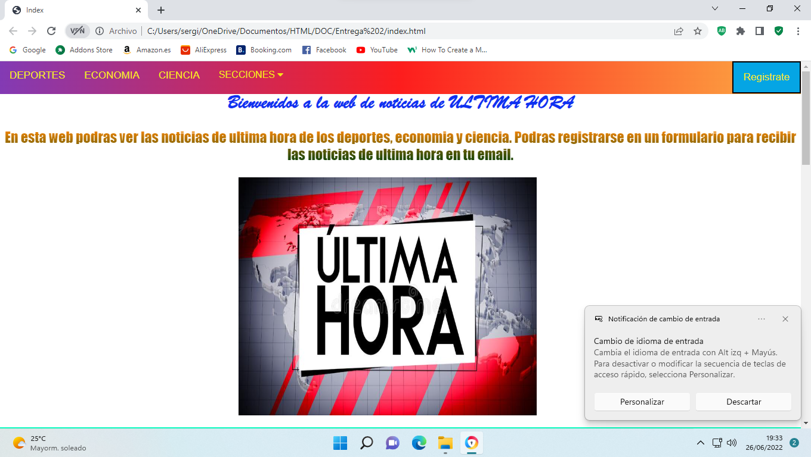
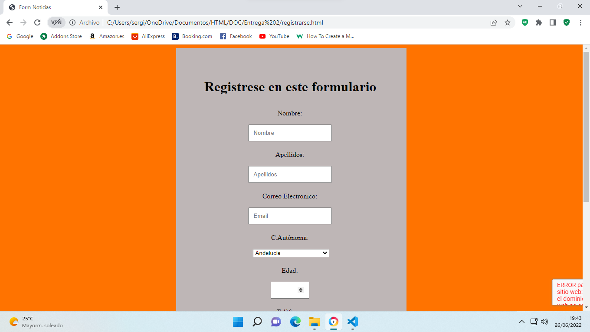
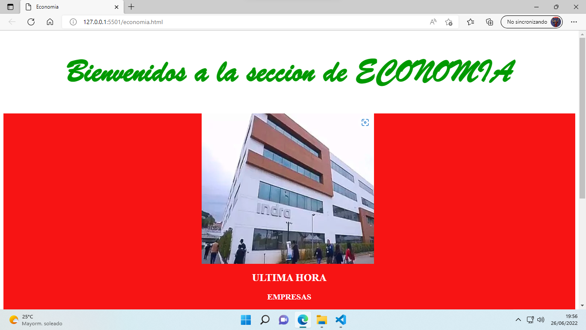
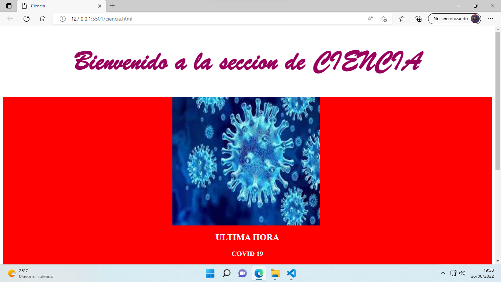
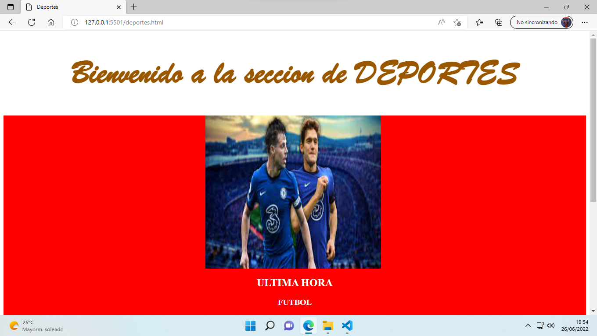

### DOCUMENTACION TECNICA

## Nombre de proycto

- News ultima hora.

## Enlace fitxero fuente

- https://github.com/Sergiocr18/Proyecto

## Descripcion del proyecto

- El proyecto trata de un blog de noticias en la cual esta la pagina principal en el que habra un menu y las noticias de ultima hora.

- En el menu habra un submenu donde habra las seccion y iras a otras webs.

- En el menu estaran escritos los nombres de las secciones en el cual cuando hagas click te ira para abajo en el nombre correspondien, en el que se utilizara scroll.

- En el menu habra un boton de registrarse, en el accederas a una web en que tendras que registrarte en un formulario y llegar un email en el que estas registrado.

- En la pagina principal, si tiras para abajo habra una noticia de cada seccion

- En las paginas de deportes, economia, ciencia, habra 3 notcia y marcado en rojo la noticia de ultimissima hora.

## Mokups

### REQUISITOS TECNICOS COMPLETOS

## Lenguajes

1 - HTML
2 - CSS
3 - JavaScript
4 - PHP

## Biblioteques

1 - Bootstrap
2 - Jquery
3 - JSon
4 - Ajax
5 - Re-Captcha
6 - PHP Mailer

## Base de dades

1 - mysql/MariaDB

## Herramientas

- Primero usare el Visual Estudio Code para dar forma a los lenguajes de codigo,
- Despues usare el GitHub para llevar el control de versiones.
- Utilizare la web freemysqlhosing.net para tener una DB en internet 24/7
- Utilizare Heroku para tener un servidor de php.
- Utilizare composer para mantener las librerias actualizadas.
- Utilizare el PHPmyAdmin para gestionar datos.

## Puntos fuertes del protyecto

- En el menu te llevara a diferentes paginas webs.

- Habra Scroll en la pagina principal.

- Registrarse en la pagina web.

### ENTREGA DEL DIAGRAMA DE GRANT FINAL

[Optional Text](./entregafinal.xlsx)
