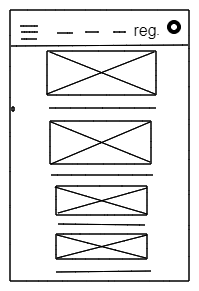
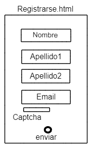
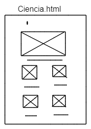
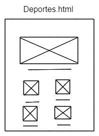
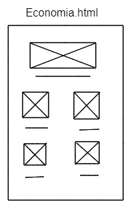
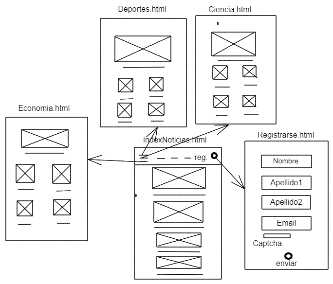
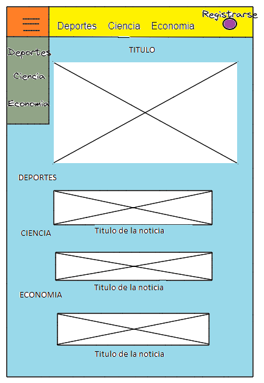

## Explicacion Previa

- Quiero crear una web utilizando lenguajes de programacion aprendidos en clase.

## Ideas para el proyecto

1 - Blog de noticias: lo voy hacer porque soy de mirar por las paginas webs y es necesaria el dia a dia .

2 - Red social: no lo voy hacer porque el codigo es muy complejo.

3 - Tienda online: no lo voy hacer porque creo que es lo mas complicado que hay para hacer webs.

4 - Cartelera: no lo voy hacer porque el codigo de como comprar entradas las entradas es muy complejo.

5 - Web de Valoraciones: no lo voy hacer porque no es lo mio dar valoraciones.

6 - Enciclopedia: no lo voy hacer porque hay mucho codigo.

7 - Terminal de gestion de vuelos: no lo voy hacer porque el codigo es muy complejo y dificil.

8 - Biblioteca: no lo voy hacer porque to lo que viene relacionado con los libros no me gusta.

9 - Recetario: no lo voy hace porque todo lo relacionado con la cocina no es lo mio.

10 - Encuestas: no lo voy hacer porque hay mucho formulario.

### Nombre del proyecto

- Blog de noticias

## Descripcion del proyecto

- La idea del proyecto seria crear un blog de noticias en la cual allala pagina principal, 3 paginas webs en la que sabras las noticias de cada seccion y habra un formulario para registrarte.

## Descripcion de las caracteristicas del proyecto

- Este proyecto sera un FrontEnd en que la pagina principal habra menu principal donde habra 3 secciones:
1 - Habra un sub menu donde podras accder a otras webs,
2 - Habra 3 secciones con scroll.
3 - Habra un boton donde te llevara a un formulario para registrarte.

### Viabilidad

## Usuarios potenciales

- Los que quieran enterarse de lo que sucede en el mundo, en su pais, en su ciudad, en su pueblo, que mire esta web.

- Los interesados seran mayores de edad.

## Mercado a cubrir

- A la gente que vean y escuchen los deportes, a los que le interesen el progreso de la ciencia en el mundo y a la gente que quiera saber como va la economia global.

### DOCUMENTACION TECNICA

## Base del proyecto

1 - HTML
2 - CSS
3 - JavaScript
4 - PHP
5 - Bootstrap
6 - mysql/MariaDB
7 - Jquery
8 - JSon
9 - Ajax
10 - Re-Captcha
11 - PHP Mailer

## Herramientas

- Primero usare el Visual Estudio Code para dar forma a los lenguajes de codigo,
- Despues usare el GitHub para llevar el control de versiones.
- Utilizare la web freemysqlhosing.net para tener una DB en internet 24/7
- Utilizare Heroku para tener un servidor de php.
- Utilizare composer para mantener las librerias actualizadas.
- Utilizare el PHPmyAdmin para gestionar datos.

## Diagrama de Grantt

[Optional Text](./proyecto.xlsx)

## Wireframes

## Paths

## Mokups

## Casos de uso

1 - Pagina Principal

- Habra una pagina principal donde este el menu, y despues habra en cada seccion el titulo de las noticias y su correspondiente foto.
- Habra un boton en el menu que ponga registrarte y te envia a un formulario donde puedas enviar tus datos y te llegue un correo elctronico diciendote que estas registrado.

2 - Boton Registrarse

- En el menu tambien aparecera un icono de las tres rayas y al clickar aparecera un menu desplegable con los correpondientes nombres y cada uno de ellos al clickar iras a una web diferente.
- Habra 3 Paginas webs con fotos y los titulos de las noticias.

3 - Menu

- En el menu tambien habra los nombres correspondientes y con el anchor, clickas y iras donde hayas clickado en esa misma pagina.
